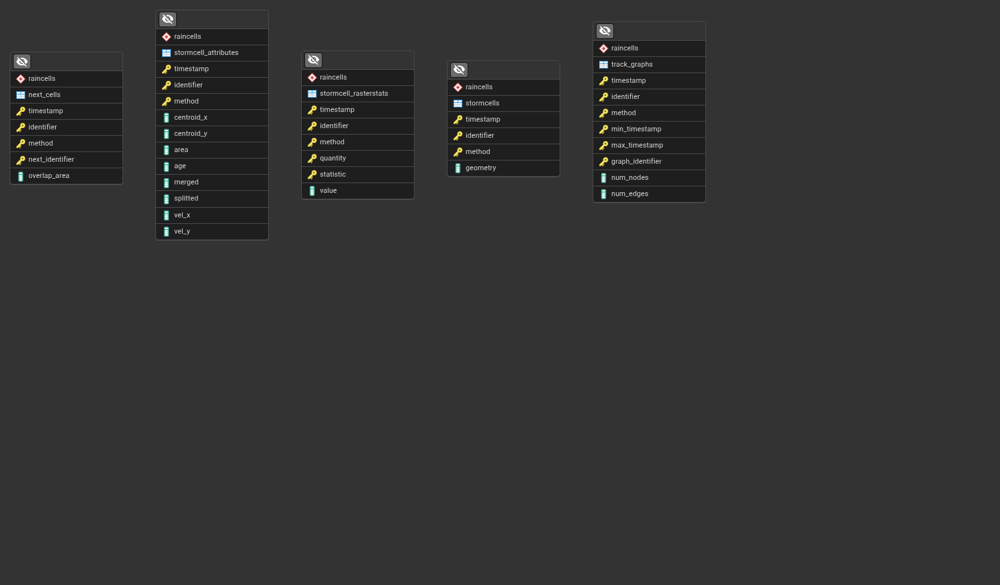

# Database structure

The database contains the following tables:

| Table                 | Description                                                                |
| --------------------- | -------------------------------------------------------------------------- |
| next_cells            | temporal connectivity with succeeding storm cells in time                  |
| stormcell_attributes  | attributes of storm cells (e.g. centroid, area and velocity)               |
| stormcell_rasterstats | zonal statistics of storm cells collected from different rasters           |
| stormcells            | polygon representations of storm cells identified from radar images        |
| track_graphs          | convenience trable storing information of which cell track cell belongs to |

Each row in the above are associated with a time stamp and a unique identifier referring to the storm cell.

Notes:

- The tables are partitioned so that one partition is created for each year.
- Each storm cell is uniquely identified by a triplet: time stamp, integer identifier and the name of the method for identifying the cell (e.q. contour_z_35 for reflectivity contours with the 35 dBZ threshold).
- The stormcell_rasterstats table follow the Entity-Attribute-Value (EAV) model. That is, one row is used for each attribute instead of assigning each attribute/statistic a table column. This makes the table operations easier, as we don't necessarily know a priori which attributes/statistics would be assigned to the storm cells. Operating on rows is easier than changing the column structure of a table.

The relations between the tables are shown in the following diagram:

## Detailed descriptions of the table columns:

### next_cells

| Column          | Description                                                                                                 |
| --------------- | ----------------------------------------------------------------------------------------------------------- |
| timestamp       | observation time of the current storm cell                                                                  |
| identifier      | identifier of the cell                                                                                      |
| method          | the method used for identifying the cells                                                                   |
| next_identifier | identifier of the next cell (timestamp + n minutes, where n is determined by the data source configuration) |

### stormcell_attributes

| Column     | Description                                            |
| ---------- | ------------------------------------------------------ |
| timestamp  | observation time of the storm cell                     |
| identifier | identifier of the cell                                 |
| method     | the method used for identifying the cells              |
| centroid_x | x-coordinate of cell centroid                          |
| centroid_y | y-coordinate of cell centroid                          |
| area       | storm area (km^2)                                      |
| merged     | does the cell result from merging of previous cells    |
| splitted   | does the cell result from splitting of a previous cell |
| vel_x      | cell velocity in x-direction                           |
| vel_y      | cell velocity in y-direction                           |

### stormcell_rasterstats

| Column     | Description                                                                                                       |
| ---------- | ----------------------------------------------------------------------------------------------------------------- |
| timestamp  | observation time of the storm cell                                                                                |
| identifier | identifier of the cell                                                                                            |
| method     | the method used for identifying the cells                                                                         |
| quantity   | the data source (quantity) of the raster                                                                          |
| statistic  | the statistic calculated with rasterstats (see https://pythonhosted.org/rasterstats/manual.html#zonal-statistics) |
| value      | the value of the statistic                                                                                        |

### stormcells

| Column     | Description                                                                                        |
| ---------- | -------------------------------------------------------------------------------------------------- |
| timestamp  | observation time of the storm cell                                                                 |
| identifier | unique identifier of the cell                                                                      |
| method     | the method used for identifying the cells                                                          |
| geometry   | the (multi)polygon defining the cell, may consist of multiple polygons that are clustered together |

### track_graphs

| Column           | Description                                                                          |
| ---------------- | ------------------------------------------------------------------------------------ |
| timestamp        | observation time of the storm cell                                                   |
| identifier       | unique identifier of the cell                                                        |
| method           | the method used for identifying the cells                                            |
| min_timestamp    | the time stamp of the first cell in the track                                        |
| max_timestamp    | the time stamp of the last cell in the track                                         |
| graph_identifier | identifier that makes the track unique together with min_timestamp and max_timestamp |
| num_nodes        | number of nodes (storm cells) in the track                                           |
| num_edges        | number of edges in the track                                                         |
